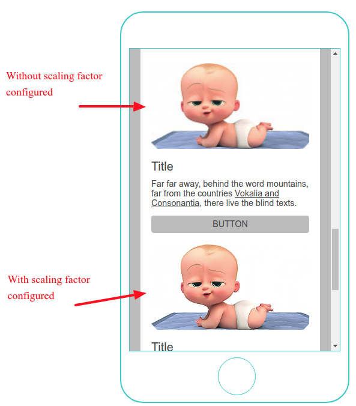

# Setup

## Support for High Resolution Images

Images when uploaded in 2 columns (e.g 258 x 100) or 3 (e.g 166 x 90) column blocks when upscaled to render on mobile devices, ends up with stretched out and lower resolution image.

Introduced `Image resize scale factor` mosaico setting attempts to solve the problem by scaling uploaded images to 2x or 3x of their block size specially for 2 and 3 column layouts so upscale doesn't look distorted or low resolution. The solution also work for single column images.

Following example shows how a correctly configured scaling factor can improve the resolution of image rendered.

__Scaling factor config example__:  
3x => Upto 285 pixels (covers both 2 and 3 column block images)  
2x => All other sizes (single column block images)

Which means when an image is uploaded in a block with 285 pixels (or less), image gets trimmed to 285 * 3 pixels instead of 285 pixels.
For any image larger than that, size is reduced to 2x size of the block.

__Note__: higher the scaling factor, higher the resolution but lower the compression.

Scaling is not tied to any particular type of image. Png format supports lossless compression and therefore compression appears less than jpg images which support lossy compression.
